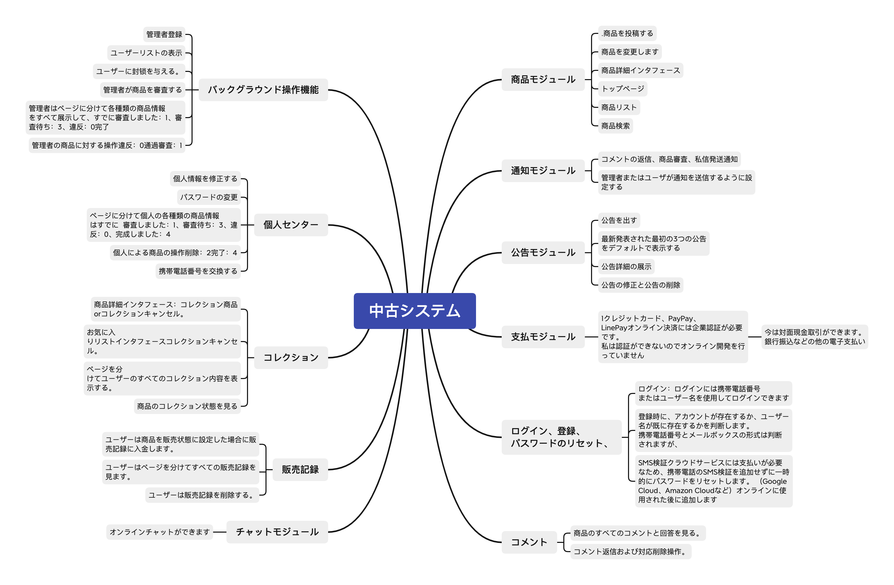

# KaichiShopping 開智国際大学 
## 新卒2026  https://yaokai.me

## 中古ショッピングサイト

### このシステムは姚凱が100%自分で開発したです
### メールに連絡hi@yaokai.me
### 開発したプロジェクトは主に新卒の活動に参加するためのものです

#### ソフトウェアアーキテクチャ
- バックエンドアーキテクチャ  SpringBoot+Spring+MyBatis+MySQL+Maven
- フロントエンドのアーキテクチャと言語  Html+Css+JavaScript+LayUI+Vue

#### 開発環境のデプロイメント（インストールする必要があります）
- JDK（バージョン1.8、およびシステム環境変数の構成）
- MySQL（5.7バージョン）
- Navicat for MySQL（ビジュアルデータベース）
- Maven
- Lombokプラグイン（簡略化されたエンティティクラス）
- IDEA（開発ソフトウェア）

#### ローカルプロジェクト実行後のアカウントとアドレス:(開発環境が構成されています）
- プロジェクトが実行されているブラウザアドレスhttp://localhost
  MySqlデータベースのアカウントパスワードはデフォルトでkaixuan2390166であり、saltで暗号化されています
  データベースのパスワードは、mysqlのインストール時に設定したパスワードに変更する必要があります。 Java実行構成ファイルで変更する
- 管理者のデフォルトの入り口http://localhost/admin アカウント管理者パスワード123456
- ユーザーログインアカウント（登録も可能）http：//localhost/login アカウントuser  password 123456
  開発ソフトウェアのプロジェクト機能

### ログイン、登録、パスワードモジュールのリセット
- 1.ログイン：ログインには携帯電話番号またはユーザー名を使用してログインできます
- 2.登録時に、アカウントが存在するか、ユーザー名が既に存在するかを判断します。
携帯電話番号とメールボックスの形式は判断されますが、メールボックスが使用されているかどうかは判断されません。
- 3. SMS検証クラウドサービスには支払いが必要なため、携帯電話のSMS検証を追加せずに一時的にパスワードをリセットします。 （Google Cloud、Amazon Cloudなど）公式に使用された後に追加します

### Xmind

### 商品モジュール
- 1.商品を公開する
- 2.商品を変更します
- 3.商品詳細インターフェース
- 4.ホーム画面
- 5.商品リストインターフェイス
- 6.商品検索インターフェース

#### コメントモジュール
- 1.製品の下にあるすべてのコメントと返信を表示する
- 2.コメントの返信と対応する削除操作

### パーソナルセンター
- 1.個人情報を変更する
- 2.パスワードを変更します
- 3.さまざまな個人製品情報のページング表示レビュー：1、保留中：3、違反：0、完了：4
- 4.商品の個人操作削除：2完了：4
- 5.携帯電話番号を変更する

#### コレクションモジュール
- 1.製品詳細インターフェース：製品をお気に入りに追加するか、お気に入りをキャンセルします
- 2.お気に入りリストインターフェイスでお気に入りをキャンセルします
- 3.すべてのユーザーのお気に入りを表示するためのページ付け
- 4.製品の回収状況を確認します

### 販売記録モジュール
- 1.ユーザーが販売する製品を設定したら、販売記録を保存します
- 2.ユーザーはページ内のすべての販売記録を表示できます
- 3.ユーザーが販売レコードを削除します

### チャットモジュール
- 1.オンラインでチャットできます

### アナウンスモジュール
- 1.アナウンス
- 2.デフォルトで最初の3つの最新のアナウンスを表示します
- 3.アナウンスの詳細の表示
- 4.変更のお知らせと削除のお知らせ
- 5.アナウンスを削除します

### バックグラウンド操作機能
- 1.管理者ログイン
- 2.ユーザーリストを表示する
- 3.ユーザーにタイトルを付ける
- 4.管理者が製品をレビューします
- 5.管理者は、すべての種類の製品情報をページ付けで表示します。すべて、レビュー済み：1、レビュー待ち：3、違反：0、完了：4
- 6.製品に対する管理者の操作違反：0監査に合格：1

### ウェブサイトの発表
- 1.管理者がWebサイトのアナウンスを公開します
- 2.管理者自身がアナウンスを編集または削除します
- 3.Webサイトのお知らせを表示する

### 通知モジュール
- 1.コメント返信、製品レビュー、プライベートメッセージ送信通知
- 2.管理者またはユーザーとして通知を送信するように設定します

### 支払いモジュール
- クレジットカード、PayPay、LinePayのオンライン決済には会社認証が必要なため。
認証できないため、オンライン決済の開発を行いませんでした
